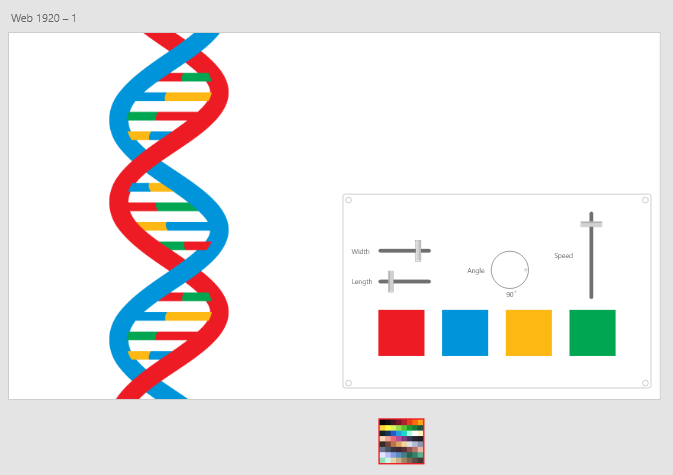
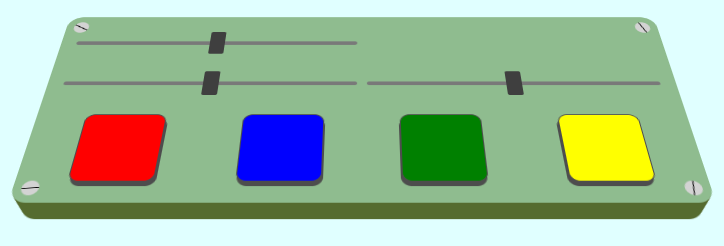
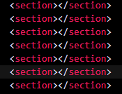
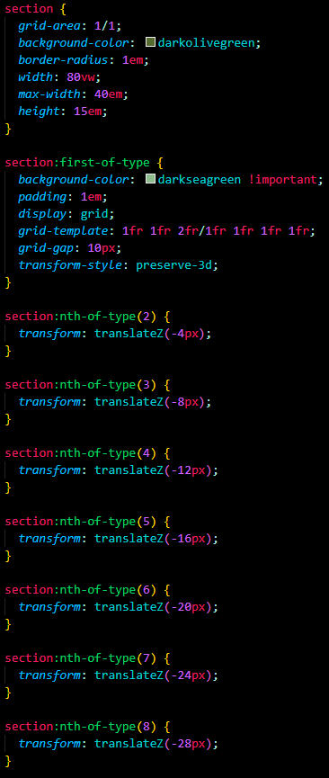
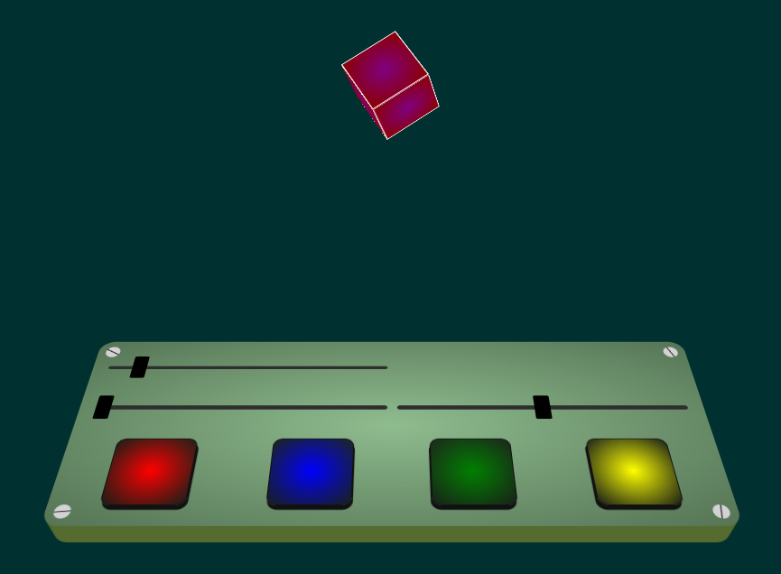
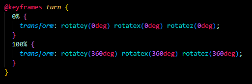
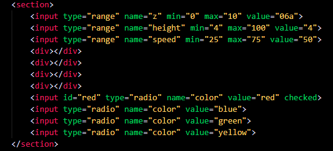
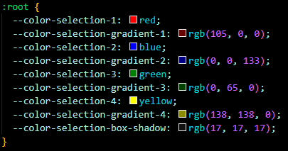
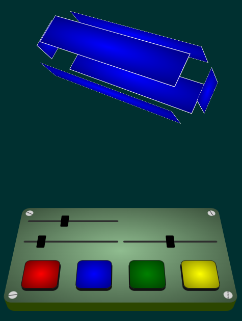

# CSS To The Rescue Readme

Dit is de readme van mijn project voor Css to the rescue.

## Week 1

Ik heb deze week een keuze gemaakt voor het project. Ik ga namelijk een control panel maken. Hoe ik dat precies ga doen weet ik nog niet helemaal maar ik ga erover nadenken.

### Feedback

Nog geen feedback deze week.

## Week 2

Deze week heb ik een begin gemaakt aan het project. Ik heb een idee bedacht en daar een snelle schets van gemaakt:

Het idee is om een animatie te laten afspelen, in dit geval een Dna string. Die kan je dan aanpassen met de control panel. Je kan de kleuren, de breedte, de lengte etc. aanpassen. 
Ik ben kort begonnen met de code. Vooral het stylen van de sliders was lastig.

### Feedback

De feedback van Sanne was dat het een goed idee is, alleen weet hij niet hoe ik de DNA string ga vormgeven. je hebt namelijk te maken met vormen die tegelijkertijd voor en achter elkaar zitten. Hier moet ik nog over nadenken. Ik denk dat ik uiteindelijk iets anders kies als animatie. Ook was het slimmer om vanuit een small screen te beginnen. Ik ga dus mijn eerste code aanpassen zodat die vanuit small screen werkt. Later ga het het ook laten werken op groot scherm

## Week 3

Deze week heb ik een 3d lesje gehad van Sanne waar ik wat inspiratie heb opgedaan voor een animatie. Ik wil graag iets met 3d animatie doen. Een kubus of andere vorm die ronddraaid lijkt mij wel leuk om te maken. Ook heb ik van het control panel een 3d versie gemaakt:

Dit heb ik voor elkaar gekregen door 8 sections neer te zetten.

Daarna heb ik in de styling gezorgd dat ze op de Z as elk 4px achter elkaar staan. Zo creeer je het 3d effect op oppervlakken met een border-radius.

### Feedback

Veel positiefs. Het 3d effect zag er goed uit. De draaianimatie was leuk. Ook heeft Sanne mij geholpen de kleurenknoppen beter te stylen.

## Week 4

Deze week heb ik veel gedaan. Ik ben opzoek gegaan naar een animatie om af te spelen boven de control panel. Dat is een 3d kubus geworden.

Ik heb gezorgd dat de kubus constant aan het draaien is met een animatie.

Hierna heb ik met behulp van de javascript code van sanne de sliders aan custom properties gekoppeld.
Zo kan ik hiermee de kubus aanpassen.
De eerste was het langer maken van de kubus. Dit leek goed te gaan totdat ik de boven en onderkant mee moest laten bewegen met de aanpassing. Dit ging lang mis. uiteindelijk ben ik gaan kijken wat de goede waarde zou zijn en ben er toen achter gekomen hoe ik die kan uitrekenen met de property van de hoogte. 

Daarna wilde ik de snelheid van de animatie aan kunnen passen. Dit was nog niet zo makkelijk omdat ik de javascript code zo had aangepast dat hij een output in em geeft. Ik heb daarom een if statement gemaakt die het bij de juiste naam omzet in seconden.

Het rode gedeelte heb ik zelf toegevoegd.

Hierna ben ik aan de slag gegaan met het aanpassen van de kleuren. Ik heb besloten het iets simpeler aan te pakken. Namelijk dat je de vlakken kan aanklikken en dat de kubus veranderd in die kleur. Eerst heb ik van de divs radio buttons gemaakt. Zo je er maar 1 selecteren en is het makkelijker om in css de kubus aan te passen. 

Ook heb ik custom properties toegevoegd die het makkelijker maken de kleuren te veranderen in de css aangezien ze veel gebruikt worden.

Ook heb ik :has gebruikt om de knoppen te koppelen aan de kubus kleuren. Zo kan je nu met de knoppen de kubuskleuren aanpassen.

Als laatste moest ik nog een slider doen. Die wilde ik aan de translateZ koppelen. Zo krijgt de kubus een cool effect dat de vlakken uit elkaar gaan. Met wat puzzelen aan de eerder gemaakte css is het uiteindelijk gelukt en is dit het eindresultaat.

